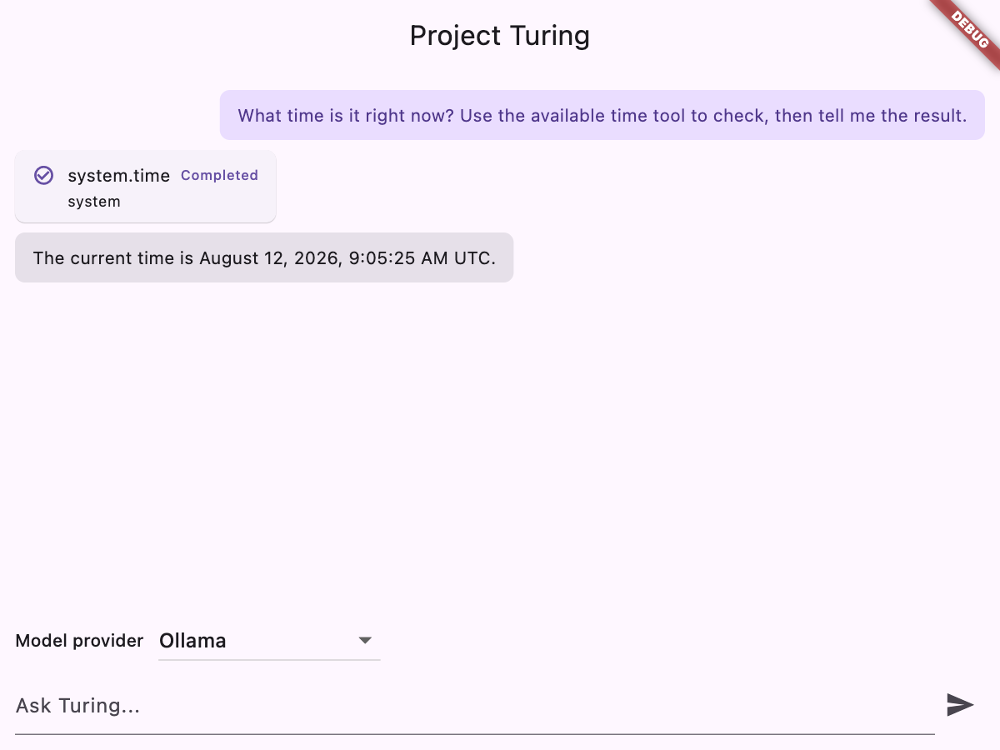

# TuringAgent

TuringAgent is a local-first AI orchestration platform for running a private assistant stack on your own machine. It pairs a Flutter client with a Go gRPC backend that owns chat sessions, model routing, streaming events, tool execution, approvals, and audit state.

The project is designed for local development first: secrets stay in your local `.env`, data is stored under `turing-backend/data/`, and file tools are constrained to `turing-backend/sandbox/`.

## What it does

- Runs a Go gRPC orchestrator for sessions, messages, runs, events, and approvals.
- Runs a Go agent runtime that connects to local or OpenAI-compatible models.
- Exposes MCP tool servers for safe system tools and approval-gated sandboxed file tools.
- Provides a Flutter client with settings, conversation search, automatically
  named session lists, chat, streamed responses, and approval cards.
- Exposes a redacted, paginated audit read API (`AuditService.ListAuditEntries`), including the approval comment or denial reason a person typed; audit inspection is exposed programmatically through the authenticated API and a thin client, with no built-in viewer yet.
- Withdraws a deleted session through a durable lifecycle: reads/search/replay
  fail closed once withdrawal starts, active work is cancelled and reconciled,
  existing subscribers receive one terminal deletion event, and newly
  session-owned sandbox artifacts are removed by policy.
- Ships a Docker Compose local stack and an end-to-end gRPC smoke test.

## Requirements

- Docker and Docker Compose
- Go 1.23+
- Flutter
- Ollama running on the host for the default local model path
- A non-root host account for backend initialization and Compose launches

By default, containers reach Ollama at `http://host.docker.internal:11434`.

## Install and run

Clone the repository and initialize local backend secrets:

```bash
git clone https://github.com/mcasillas17/TuringAgent.git
cd TuringAgent/turing-backend
./scripts/init.sh
```

`init.sh` rejects root execution, creates `turing-backend/.env`, generates local
bearer tokens, records the current non-root UID/GID for bind-mounted storage,
creates `data/`, `skills/`, and a real (non-symlink) `sandbox/`, and prints the
Flutter client API key. It fails rather than changing ownership or permissions
when existing sandbox content is inaccessible. Do not commit `.env`.

Start the backend stack:

```bash
./scripts/dev.sh
```

This builds and runs the orchestrator, agent runtime, and MCP servers through
Docker Compose. The public gRPC API bind address is fixed to `localhost`; its
host port defaults to `3000` and can be changed with
`ORCHESTRATOR_PUBLIC_PORT`.

Use the repository scripts rather than invoking this Compose file directly.
`scripts/compose.sh` validates and injects the current non-root host UID/GID;
this prevents stale `.env` values or exported `HOST_UID`/`HOST_GID` variables
from selecting the identity used for the data, skills, and sandbox bind mounts. All
backend services otherwise run with read-only roots, no Linux capabilities, and
`no-new-privileges`; only `/app/data`, `/skills`, and `/sandbox` are writable.

In another terminal, run the Flutter app:

```bash
cd turing-client/turing_app
flutter pub get
flutter run -d macos
```

On first launch, enter:

- **Backend URL:** `http://localhost:3000`
- **API key:** the `Flutter client API key` printed by `./scripts/init.sh`

The sandboxed macOS builds include the outbound-network entitlement required to
reach the local backend.

## Verify the stack

Run the backend smoke test:

```bash
cd turing-backend
./scripts/smoke-grpc.sh
```

To verify that a real Ollama model chooses `system.time` from a natural-language
prompt and uses its result, run the on-demand live check:

```bash
cd turing-backend
TURING_VERIFY_MODEL=qwen2.5:7b TURING_VERIFY_ATTEMPTS=3 ./scripts/verify-tool-loop.sh
```

The live check prints `PASS`, `FAIL`, or `INCONCLUSIVE`. Exit code `0` means
`system.time` completed and the later final answer reflected the returned UTC
timestamp in post-tool output using ISO, clock, or Unix epoch form. Exit code
`1` means that exercised
lifecycle was broken; this includes a timeout after `system.time` starts. Exit
code `2` means the proof could not exercise that lifecycle, including
unavailable Ollama or model, setup failure, a pre-tool timeout, a different tool
choice, no tool choice, or an answer that could not be correlated to the
returned time.
Set `TURING_VERIFY_OLLAMA_URL` when Ollama is exposed at a non-default host URL.
The wrapper maps localhost to `host.docker.internal` for Compose; set
`TURING_VERIFY_OLLAMA_CONTAINER_URL` only when containers need a different URL.
Recoverable model-generated tool arguments are retried within the same run and
remain inconclusive unless a later `system.time` call succeeds. Explicit model
provider failures and output/tool-call guardrails are also inconclusive rather
than loop failures. This non-deterministic check is intentionally not run in CI.



Run developer checks from the repository root:

```bash
go test -tags sqlite_fts5 -race ./... -count=1
go vet -tags sqlite_fts5 ./...
go build -tags sqlite_fts5 ./...
cd turing-backend/mcp-files && go test -race ./... -count=1 && go vet ./... && go build ./cmd/server
cd ../mcp-system && go test -race ./... -count=1 && go vet ./... && go build ./...
cd ../../turing-client/turing_app && flutter analyze && flutter test
```

## Configuration

Backend configuration lives in `turing-backend/.env`, copied from `turing-backend/.env.example`.

Common values:

| Variable | Purpose |
|---|---|
| `TURING_CLIENT_API_KEY` | Bearer token for Flutter and other public gRPC clients |
| `TURING_RUNTIME_TOKEN` | Bearer token for the agent runtime's internal gRPC calls (claim jobs, read session history, poll/consume approvals) |
| `TURING_APPROVAL_CONSUMER_TOKEN` | Bearer token for mcp-files' internal gRPC calls; authorized for `ApprovalService.ConsumeApproval`, `FinalizeSandboxArtifact`, and `CheckSessionCapability`, never the runtime's methods |
| `TURING_APPROVAL_JWT_SECRET` | HS256 secret used for approval tokens |
| Approval-consumer scope | `ApprovalService.ConsumeApproval`, `FinalizeSandboxArtifact`, and `CheckSessionCapability`; never runtime-only methods |
| `TURING_APPROVAL_TIMEOUT_MS` / `TURING_APPROVAL_WAIT_TIMEOUT_MS` | Approval lifetime and the longer runtime observation bound (defaults: 65s / 71s) |
| `TURING_TOOL_TIMEOUT_MS` / `TURING_TOOL_TOTAL_TIMEOUT_MS` | Per-request MCP timeout and whole-tool lifecycle timeout (defaults: 30s / 180s) |
| `HOST_IDENTITY_MODE` | Managed compatibility marker; `init.sh` always resets it to `auto` |
| `HOST_UID` / `HOST_GID` | Current canonical non-root host IDs, managed by `init.sh` and overridden safely by `scripts/compose.sh` at launch |
| `ORCHESTRATOR_GRPC_ADDR` | Internal orchestrator gRPC address, usually `turing-orchestrator:3001` |
| `OLLAMA_BASE_URL` / `OLLAMA_MODEL` | Local model endpoint and default model |
| `OLLAMA_KEEP_ALIVE` | How long Ollama holds the model in memory after a reply (default `2m`). Accepts a duration (`30s`, `2m`) or whole seconds (`-1` = forever); integer spellings are canonicalized before JSON encoding. Sent per request, so it does not depend on Ollama's own env var. Keep it above `TURING_APPROVAL_WAIT_TIMEOUT_MS` or the model unloads mid-run |
| `OLLAMA_CONTEXT_WINDOW_TOKENS` | Local context cap and advertised routing ceiling (default `32768`). Must be `1`–`16777216`; invalid values fail startup. Every request sends an explicit `options.num_ctx` rounded up to a stable power-of-two bucket covering admitted prompt bytes plus output reserve, never above this cap. Small requests avoid the maximum allocation, nearby turns reuse the same runner, and the runtime never relies on the host default |
| `OLLAMA_MAX_OUTPUT_TOKENS` | Answer reservation inside the Ollama window (default `2048`). Must be positive and smaller than the window; sent as `options.num_predict`. A `length` stop emits a durable run notice |
| `OPENAI_API_KEY` / `OPENAI_MODEL` | Optional OpenAI-compatible model configuration |
| `OPENAI_CONTEXT_WINDOW_TOKENS` | Local window and advertised routing ceiling for OpenAI-compatible models and routed external agents (default `32768`, same validation). Match it to the configured model; it is enforced locally and is not sent as Ollama's `num_ctx` |
| `OPENAI_MAX_OUTPUT_TOKENS` | Answer reservation for OpenAI-compatible requests (default `2048`); sent as `max_completion_tokens` for o1/o3/o4 and GPT-5 model families, and `max_tokens` otherwise. A `length` stop emits the same durable notice |

### Context budgeting

Before every model dispatch, the runtime measures the exact provider-specific JSON request. Without provider tokenizers, it conservatively treats each serialized UTF-8 byte as an upper bound of one prompt token, then requires that upper bound plus the configured output reservation fit the context window. This is intentionally not exact tokenizer usage or billable provider usage; Turing does not currently discover model capabilities.

The runtime always keeps mandatory skill context (legacy attached bodies and explicitly invoked file-skill bodies), the current user turn, and every assistant tool-call/result message and correlation ID. A bounded enabled-skill metadata index is included when it fits; if any enabled metadata cannot fit, the runtime emits a durable omission notice instead of hiding the loss. If a result body is too large, its whole content is replaced by an explicit JSON omission marker; the protocol message itself is never dropped or split. The runtime then admits a stable prefix of whole optional tool definitions (definitions referenced by live protocol are mandatory), the whole recall block, and a contiguous suffix of newest complete history turns.

Recall search runs once per agent run; each term uses separate bounded earlier-session and current-session searches so a busy current session cannot crowd earlier matches out of the result page. Earlier-session matches receive excerpt slots first, then omitted current-session history can use the remaining capacity. Cached hits are re-ranked against each dispatch's budget-admitted request rather than re-querying unchanged terms across tool iterations. The cache retains one recall-budget-bounded payload per unique message plus lightweight per-term references, so overlapping search pages do not retain duplicate full messages. Fetched history and the live user turn carry message IDs into budgeting, so current-session deduplication suppresses exact admitted rows; occurrence counts are only a defensive fallback for ID-less callers. Admitting one of two identical turns therefore does not erase an older omitted row even when the newer row is absent from the search page. If adding recall changes the admitted history suffix, the runtime allows up to three ranking/budget passes under one two-second deadline; one broad fallback then prefers a possible duplicate over silently losing a current-session turn from both history and recall.

Each changed omission set is persisted as an `agent.run.step` notice and rendered inline during the live run. Historical run notices are currently suppressed by the client replay watermark, so reopening a session does not yet redisplay them. If even the current turn, skills, required schemas, tool protocol, and minimal result markers cannot fit, the run fails with `context_budget_exceeded`; for a newly requested tool chain, that feasibility check occurs before any tool side effect.

When a provider stops because it reaches the configured output reservation, the partial answer remains successful but a durable `agent.run.step` notice names the matching output setting. The notice is emitted before a final completion or before executing a complete tool call from that length-limited turn. If an OpenAI-compatible stream reaches `length` with an unfinished tool fragment, the fragment is discarded and never executed.

Focused verification:

```bash
go test -tags sqlite_fts5 ./turing-backend/agent-runtime-go/internal/config ./turing-backend/agent-runtime-go/internal/llm ./turing-backend/agent-runtime-go/internal/agent ./turing-backend/orchestrator-go/internal/service/runtime ./turing-backend/tests -count=1
```

### Legacy skill recovery cleanup

An upgrade through migration 0011 exports old database-backed skills into
`turing-backend/skills/imported/` and retains a recovery copy in SQLite.
TuringAgent re-exports that copy on startup but never deletes nonempty recovery
rows automatically, because SQLite and the filesystem cannot commit atomically.

To remove the recovery copy, stop the orchestrator, back up the configured
database (the Compose default is `turing-backend/data/turing.db`), and verify
every row returned by
`SELECT id FROM legacy_skill_export_recovery ORDER BY id;`. An ID matching
`^[A-Za-z0-9][A-Za-z0-9._-]*$` (except `.` and `..`) maps directly to
`skills/imported/<id>/SKILL.md`. Every other ID maps to
`skills/imported/skill-<hash>/SKILL.md`, where `<hash>` is the first 16 lowercase
hex characters of SHA-256 over the ID's exact UTF-8 bytes. While the
orchestrator remains stopped, use a SQLite client to run
`DROP TABLE legacy_skill_export_recovery;`, then restart.

## Troubleshooting

- **Backend is not reachable:** check that Docker Compose is running and port `3000` is free.
- **Authentication fails:** confirm the Flutter API key matches `TURING_CLIENT_API_KEY` in `turing-backend/.env`.
- **No model response:** ensure Ollama is running on the host and the configured model is available.
- **Run fails with `context_budget_exceeded`:** the current user turn, attached skills, required schemas, or minimal live tool protocol cannot fit alongside the output reservation. Increase the matching provider window only when the selected model supports it, or lower its output reservation; Turing will not split protocol to force a request through.
- **Smoke test times out:** inspect the `turing-orchestrator` and `turing-agent-runtime-general` container logs.
- **Initialization refuses root:** run it from the non-root host account that owns the checkout and sandbox; do not use `sudo`.
- **Initialization reports legacy sandbox content:** restore ownership and owner read/write access (plus directory traversal) outside the script, or move the content aside, then rerun `scripts/init.sh`. The script deliberately does not recurse with `chmod` or `chown`.
- **File tools fail:** confirm `turing-backend/sandbox/` is a real directory, rerun `scripts/init.sh`, and confirm approval-required writes were approved. Rootless Docker, `userns-remap`, and SELinux may require daemon-specific ownership/mapping or labeling; see the MCP security guide.

## Session withdrawal and physical erasure

`DeleteSession` returns a typed receipt. Only `completed` means all
session-owned database state and delete-on-session-delete sandbox artifacts
were withdrawn; `in_progress` and `failed_external` are retryable, non-success
states that keep the conversation hidden. The only retained artifact policy is
`retain_legacy_unowned` for sandbox-root files created before provenance was
available; its count is recorded without claiming those bytes were withdrawn.

This is **logical withdrawal**, not a forensic storage-erasure promise.
SQLite WAL, freed pages, filesystem snapshots, SSD wear leveling and separately
copied backups can retain historical bytes. Checkpointing, `VACUUM`, or
`secure_delete` do not change that product boundary. Whole-database encryption
with destruction of every database-key wrapper and encrypted backup is a
credible future database-retirement strategy, but one database key cannot
selectively erase a single session; TUR-004 does not add an encryption library
or migration.

## Documentation

- [Tech stack and architecture](docs/architecture/tech-stack.md)
- [Stable session title lifecycle](docs/architecture/session-titles.md)
- [Audit read API](docs/architecture/audit-read-api.md)
- [MCP security and approval flow](docs/mcp-security-and-integration.md)
- [Flutter client guide](turing-client/turing_app/README.md)
- [Go/gRPC migration design](docs/superpowers/specs/2026-05-15-turing-go-grpc-migration-design.md)
