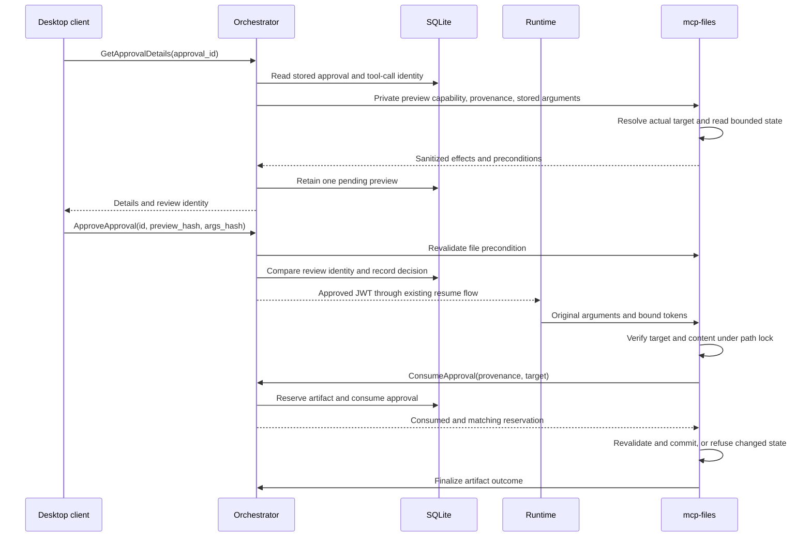

# Inspectable approval previews

Approval review shows a bounded, server-derived description of the proposed
operation before a human authorizes it. Flutter renders that description;
the orchestrator owns the decision and bundled mcp-files owns filesystem
resolution and the protected mutation.

## Reviewing a request

An approval card loads details automatically. For `files.create` and
`files.update`, it shows the resolved sandbox-relative target and a complete
bounded replacement diff. Expand **Before and after content** to inspect both
versions, or **Reviewed content identity** to inspect the argument, preview,
and file hashes. Scroll the review body; Approve and Deny remain separate
controls below it. The displayed target can be a session/run-owned path,
not merely the logical filename in the original request.

Approve is disabled while details are loading, unavailable, stale, expired,
redacted, binary, oversized, or otherwise not safely reviewable. Deny remains
available for a pending request even if the preview cannot load; a decision
already in flight disables both buttons to avoid conflicting taps.

**Retry preview** and **Refresh preview** explicitly prepare a new snapshot
of a still-pending request. Neither authorizes anything. A changed snapshot
requires a separate Approve action. A routine detail read does not replace
the stored snapshot; it reports whether the reviewed file precondition still
holds. Opening, retrying, or refreshing does not extend the approval deadline.

If the target changes after approval, the protected write refuses the old
precondition. An approved or consumed authorization cannot be refreshed into
permission for different content. Request the action again to obtain a new
approval. A failure after consumption does not restore the token.

## Public contract and compatibility

`ApprovalService.GetApprovalDetails` is authenticated with the existing
public client bearer. The internal runtime and approval-consumer identities
cannot use this human-facing RPC. The request contains `approval_id` and an
optional `refresh_preview`; no replacement arguments or replacement file
contents are accepted.

`ApprovalDetails` identifies the stored approval, session, run, tool call,
server and tool. It includes the original canonical `args_hash`, an opaque
server-issued `preview_hash`, expiry, durable approval status, preview state,
bounded structured arguments, optional file preview, and `can_approve` /
`can_deny`. Unkeyed argument hashes are withheld when the arguments are not
safely disclosed. The keyed preview identity can still identify a
non-reviewable snapshot without exposing a low-entropy credential hash.

For file mutations, `arguments_json` is `{}`: a ready preview's complete
effect is already in its target, operation, before/after content and hashes,
and non-ready previews do not retain a spare argument-content copy. This
optional display field is not the stored canonical execution arguments.
Non-file tools retain their safe bounded structured argument view.

`ApproveApprovalRequest` adds `preview_hash` and `args_hash` to its existing
approval ID and optional comment. Both must match the stored current review.
The server loads the execution arguments from its own durable approval;
the client cannot substitute arguments using this RPC. Denial and its
optional rationale do not require a preview hash.

These protobuf additions do not remove or renumber existing fields. An
older client that omits review binding cannot approve a request; it can still
deny one. A new client talking to a backend without the detail RPC reports
preview unavailable and does not fall back to unbound approval. Rebuild the
desktop client and backend together when upgrading. Old unbound file tokens
cannot bypass mcp-files' required write binding.

## File semantics and authorization flow

Create means an absent target followed by the exact requested UTF-8 content.
An absent file is distinct from an existing empty file. Update replaces the
entire file with `content`; it is not an append or a client-generated patch.
An explicit `expectedHash` must agree with the observed/reviewed before hash.
The reviewed before hash is enforced even if that optional argument was omitted.

1. The orchestrator records the tool call and canonical arguments and creates
   the pending approval through the existing lifecycle.
2. The authenticated client reads details. For bundled files, the
   orchestrator calls mcp-files' private `POST /internal/approval-preview`
   using a short-lived, domain-separated preview capability and fresh
   session provenance. This endpoint is not a discoverable MCP tool and
   cannot consume an approval, reserve an artifact, or create directories.
3. mcp-files uses the same validators, scoped physical-path resolver,
   descriptor-relative opens and cooperating-writer lock as execution.
   The orchestrator retains one bounded sanitized snapshot and its keyed
   identity, tied to the approval and withdrawal generation.
4. Approve revalidates the file state and atomically compares the stored
   preview identity before recording the normal approval decision. The
   existing approval JWT binds the physical target, before existence/hash,
   after hash, preview identity and session/run/tool-call provenance in
   addition to the original canonical argument hash.
5. mcp-files verifies those claims and the current precondition before
   consuming the ordinary approval over authenticated internal gRPC. It
   rechecks the session, target resolution, parent descriptor identity and
   file state at the protected commit boundary while holding its path lock.
   Create uses no-clobber publication; update retains the existing final
   inode/content comparison before atomic replacement.
6. Existing artifact reservation/finalization and run-outcome handling report
   the result. Reading a preview never performs these mutation steps.

Initial preparation and explicit refresh use one private file read when their
fresh snapshot is the one actually retained. A concurrent first reader that
loses that race revalidates the retained snapshot instead. Ordinary reads of
a stored ready file snapshot and approval decisions revalidate it.

## States and limits

| State | Meaning and available action |
|---|---|
| Ready | Complete bounded file preview; approval requires its current binding. |
| Unsupported | Safe structured arguments, but no invented before/after effects for a non-file tool. |
| Unavailable | Preparation or current-state checking failed. Retry or deny; failure is not an empty existing file or a claim that it changed. |
| Stale | An observed file precondition no longer matches. Refresh a pending request, review again, then decide. |
| Redacted | A sensitive path, field or credential-like value was detected. Approval is disabled. |
| Binary | Invalid UTF-8 or non-text controls prevent text review. Approval is disabled. |
| Oversized | A bound was exceeded. No partial preview can authorize the operation. |
| Expired / terminal | This request can no longer authorize new work. |

| Bound | Value |
|---|---|
| Before text and after text | 64 KiB each, measured in bytes |
| Stored argument read and structured argument preparation | 128 KiB |
| Diff output | 256 KiB |
| Serialized retained snapshot | 2 MiB, one row per approval |
| Private preview HTTP request timeout | 5 seconds; redirects refused |
| Flutter detail/decision RPC deadline | 10 seconds |

The diff is one linear replacement hunk, not a quadratic minimal-edit
algorithm. Empty files and missing final newlines are represented explicitly.
Exceeding a bound produces a non-approvable state rather than a shortened
display labeled complete.

The existing raw file mutation validator accepts up to 512 KiB, but the
effective reviewed mutation ceiling is **64 KiB for both before and after**.
Larger inputs can therefore receive an explicit oversized refusal; they
cannot be approved by a human or an unattended automation. Tool descriptions
disclose this distinction. Do not repeatedly retry unchanged oversized or
binary content. Edit such files directly with an appropriate local editor.

## Redaction, retention and non-file tools

Redaction covers sensitive paths and known credential containers, credential
fields and assignments, authentication/cookie headers, private keys, common
token forms and credential-bearing URLs. It does not rely on entropy:
short passwords are still credentials. Ordinary prose merely mentioning
secret, token or authorization is not itself a credential assignment.

This is conservative detection, not a universal secret-discovery guarantee.
False positives can prevent approval, including examples containing
credential-shaped assignments. Do not put credentials into tool arguments
or ask this workflow to edit secret-bearing files. Deny a flagged request
and use an appropriate local editor; there is no hidden-content override.

Non-file tools retain orchestrator-side argument/server/run approval
enforcement and run-owned egress consent. Safe bounded arguments are
inspectable with an explicit unsupported-effects notice. Redacted, binary
or oversized arguments are non-approvable for these tools too; unsupported
effects are not permission to authorize undisclosed arguments. Credentials
managed by integrations remain server-side rather than being copied into
approval display arguments. Automation allowlists use the existing
unattended authorization path, but must still obtain a valid bound
precondition; automation is not a human review.

Preview snapshots are local SQLite state, not audit events. A refresh replaces
the one row for that approval. The per-row bound is not a global database
quota: retained snapshots follow the approval/session lifecycle and may
remain after an approval expires. Withdrawal immediately purges preview
rows, and completed session deletion also cascades them. Generation and
lifecycle checks prevent an in-flight preparation from recreating withdrawn
state or returning its content.

No new file bodies are copied into audit/events to implement this feature.
Preview redaction does not retroactively scrub existing tool argument rows,
transcripts, legacy events, backups or unrelated stores. The audit read API
remains a separate metadata/rationale surface, not the preview transport.

## Filesystem and deployment assumptions

The orchestrator still does not mount the sandbox or hold the normal
mcp-files bearer. It uses the existing internal MCP base URL and approval
signing secret; preview capabilities have their own token kind and cannot
serve as approval or provenance tokens. The cleanup-only credential retains
its existing scope. No new host-published port is needed.

Path traversal, symlinks, cross-session resolution, creation collisions and
observed content/target changes are refused using existing confinement and
provenance checks. The process-local path lock coordinates cooperating
mcp-files writers. A privileged host process that ignores that lock can
still race the final POSIX comparison/rename interval; this is not a
filesystem-wide compare-and-swap against arbitrary external writers.
Protect the sandbox mount and avoid concurrent privileged external edits.

Use the existing approval TTL and runtime wait settings together. Preview
reads never extend those lifetimes or revive cancelled/deleted work.
