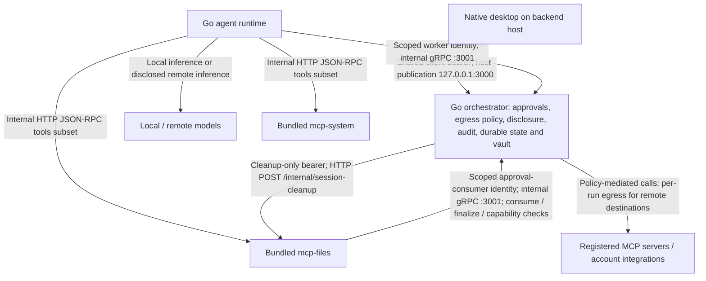

# TuringAgent Tech Stack and Architecture

This document captures the implementation details that are useful for contributors but too detailed for the root README.

## Runtime architecture

TuringAgent has four backend processes plus a local Flutter client:

| Component | Location | Responsibility |
|---|---|---|
| Go orchestrator | `turing-backend/orchestrator-go` | Public gRPC API, internal runtime gRPC API, sessions, messages, runs, events, approvals, audit records, a redacted public audit read API, SQLite persistence |
| Go agent runtime | `turing-backend/agent-runtime-go` | Connects to the orchestrator, loads session context, calls model providers, executes the HTTP JSON-RPC tools subset, streams runtime updates |
| MCP system server | `turing-backend/mcp-system` | Safe system tools exposed over an HTTP JSON-RPC tools subset |
| MCP files server | `turing-backend/mcp-files` | Sandboxed file tools; mutating tools require approval JWT validation and gRPC approval consumption |
| Flutter client | `turing-client/turing_app` | Thin UI for settings, conversation search, sessions, chat, streamed events, model selection, and approvals |

The client talks to the orchestrator through gRPC. The agent runtime calls
bundled MCP servers over internal HTTP JSON-RPC. Registered-server calls instead
go through orchestrator gRPC; the orchestrator mediates their HTTP requests and
egress policy. Bundled MCP servers are not published to the host.



This is the current local boundary, not the
[target home-hub architecture](../NORTH_STAR.md#target-architecture).
The mcp-files return path uses internal gRPC `:3001`, independently of the
worker identity, to consume approvals, finalize artifacts and check session
capabilities.
Session withdrawal uses the separate orchestrator-to-mcp-files HTTP cleanup
edge. Its cleanup-only bearer is not the approval-consumer identity used by
the reverse gRPC edge.
The orchestrator also mediates registered third-party MCP and integration
calls. Registry management is not full MCP conformance (CON-001).
Mobile scaffolding does not add pairing, non-loopback TLS or reachability:
a LAN/tailnet URL alone cannot reach the Compose loopback publication.

For what the shipped session-recall capability does—and the two intentionally deferred model-context and summary layers—see [Session recall scope](session-recall.md).

For the public, redacted audit read API — its exact filters, keyset cursor,
per-action field allowlist, and deletion-scrub semantics — see
[Audit read API](audit-read-api.md).

For authoritative run lifecycle/outcomes, failure redaction, version fencing,
restart behavior, and Flutter reconciliation, see
[Durable run outcomes](run-outcomes.md).

## gRPC and protobuf

Protocol definitions live under `proto/turing/v1/`.

Generated code:

- Go: `gen/turing/v1/go/turing/v1/`
- Dart: `turing-client/turing_app/lib/generated/turing/v1/`

Use the [proto toolchain guide](../../tools/proto/README.md) for the pinned
generators and Buf compatibility command. `breaking.sh` requires the pinned
Buf version and network access to refresh its configured remote base; unlike
the documentation guard, it is not an offline check. The
[developer checks](#developer-checks) below list common commands.

The public orchestrator gRPC port defaults to `3000`. The internal runtime gRPC port defaults to `3001`.

TUR-019's Buf breaking-change gate and the deterministic generated-code check
are separate CI steps. Neither is pending. The
[status guard](../../tools/docs/README.md) ties their documented status to the
workflow and implementation witnesses without invoking Buf or protoc. Its
codegen probe runs an isolated copy of `check.sh` with a deterministic fake
generator, never regenerating this checkout.

`AuditService.ListAuditEntries` is registered on the public server only —
never on the internal one — and authenticated with the same
`TURING_CLIENT_API_KEY` bearer token as every other public RPC. See
[Audit read API](audit-read-api.md) for its filters, pagination, and
redaction contract.

## Durable run outcomes

`agent_runs` is the sole lifecycle/outcome authority. Its monotonic
`state_version`, canonical UTC update time, closed outcome category, correlated
message IDs, and internal assistant-content digest are updated with exactly one
lifecycle event in a short guarded transaction. `SessionService.ListMessages`
embeds the safe public `RunState` on the assistant row, while live lifecycle
events carry the same snapshot. Event replay therefore delivers state but never
reconstructs a competing answer.

Worker assignments carry the expected state version and durable assignment
attempt ID. Terminal reports, ownership recovery, and approval Ready/Accepted
resume are fenced by those values. Confirmed-unsent `pending_send` work may move
directly from running back to queued; delivered or uncertain work first enters
durable recovering. Provider/tool/worker prose is normalized to closed categories
before persistence and is absent from the public contract.

Flutter reconciles by run ID and version, renders localized terminal/recovery
cards beside the correlated assistant message, and bounds pre-history buffering
to 64 run states. Completed content does not gain redundant terminal noise;
completed-with-no-content, failed, cancelled, unknown, missing-content, and
neutral legacy cases remain explicit after restart.

## Docker Compose services

`turing-backend/infra/docker-compose.yml` starts:

| Service | Network exposure |
|---|---|
| `turing-orchestrator` | Publishes the public gRPC port (default `3000`) on `127.0.0.1`; exposes internal gRPC port `3001` only inside Docker networks |
| `turing-agent-runtime-general` | Internal Docker networks only |
| `turing-mcp-system` | Internal `net-system` network only |
| `turing-mcp-files` | Internal `net-files` network only |

Compose uses explicit `environment:` blocks instead of `env_file:` so services receive only the secrets and config they need.

Every service has an explicit non-root runtime identity, a read-only root
filesystem, `cap_drop: ALL`, and `no-new-privileges`. Only the orchestrator's
`/app/data`, `/skills` and `/memory` plus `mcp-files`' `/sandbox` are writable. Each
service replaces Docker's default writable `/dev/shm` with a 64 KiB read-only
tmpfs.

## Model providers

The default local model path is Ollama:

```text
OLLAMA_BASE_URL=http://host.docker.internal:11434
OLLAMA_MODEL=qwen2.5:7b
OLLAMA_CONTEXT_WINDOW_TOKENS=32768
OLLAMA_MAX_OUTPUT_TOKENS=2048
```

OpenAI-compatible models can be configured with:

```text
OPENAI_BASE_URL=https://api.openai.com/v1
OPENAI_API_KEY=
OPENAI_MODEL=gpt-4o-mini
OPENAI_CONTEXT_WINDOW_TOKENS=32768
OPENAI_MAX_OUTPUT_TOKENS=2048
```

Both context values must be integers from `1` through `16777216`. Each is also the exact routing ceiling advertised by the runtime; Turing does not infer limits from model names. Each output value must be positive and smaller than its context window; invalid configuration stops the runtime at startup. Ollama receives `num_predict` plus an explicit `num_ctx` rounded up to a stable power-of-two bucket that covers exact admitted request bytes and output reserve, capped by `OLLAMA_CONTEXT_WINDOW_TOKENS`; small requests avoid the cap's full KV-cache allocation while nearby turns reuse one runner size. OpenAI-compatible providers and routed external agents use their window for local admission and receive `max_completion_tokens` for o1/o3/o4 and GPT-5 model families, or `max_tokens` otherwise, so no Ollama-only option leaks onto their wire format. Operators must match each cap to the selected model.

Before dispatch, each built-in provider serializes the exact JSON request it would send. The runtime conservatively counts one UTF-8 request byte as an upper bound of one prompt token and requires that bound plus the output reservation fit the configured window. This intentionally avoids claiming exact tokenizer or billing usage while providing one deterministic bound for messages, tool schemas, aliases, and provider framing.

Admission priority is:

1. Attached skills, the current user turn, and every live assistant tool-call/result message and correlation ID. Oversized result bodies are replaced whole by explicit omission markers.
2. A stable prefix of whole optional tool definitions; any definition referenced by live protocol is mandatory.
3. The whole attributed recall block.
4. A contiguous suffix of complete history turns, newest first.

Recall search runs once per agent run, with separate bounded earlier-session and current-session searches per term so one scope cannot crowd the other out. Earlier-session matches receive excerpt slots first; omitted current-session history fills remaining capacity. The runtime caches one recall-budget-bounded payload per unique message plus lightweight per-term references. Fetched history and the live user turn retain message IDs through context assembly, so re-ranking suppresses exact admitted rows; occurrence counts are only a defensive fallback for ID-less callers. The runtime permits up to three ranking/budget passes under one two-second deadline if adding recall changes the contiguous history suffix. One broad fallback allows possible duplication rather than silently excluding a fetched current-session turn from both paths.

Optional material is removed only in whole units. Whenever the omission set changes, the runtime emits an `agent.run.step` with `reason=context_budget`; the orchestrator persists it and the Flutter client renders its `note` inline during the live run. The replay watermark still suppresses historical nonterminal notices whose position cannot be reconstructed, while the run's authoritative recovery or terminal state reopens from message history. Mandatory live protocol that does not fit even with minimal result markers fails with `context_budget_exceeded`; a prospective tool chain is checked before tool execution. Provider request marshaling retains a separate 16 MiB hard limit but never trims history itself.

A provider completion with finish reason `length` emits a durable `agent.run.step` with `reason=model_output_limit`, the configured reservation, and the relevant environment setting. The partial answer can still complete, but the cap is never silent; for a complete tool-call turn, the notice precedes tool execution. An unfinished OpenAI-compatible tool fragment at `length` is discarded rather than executed or mislabeled as protocol corruption.

The Flutter client sends the selected provider with each message. The backend owns provider routing, context admission, and model execution.

The Agents page manages endpoint records. `SessionAgentBar` reads/sets/clears
the conversation route through `ExternalAgentService`, and the runtime's
resolver performs inference using the OpenAI-compatible transport.
Vendor names are descriptive labels, not native Anthropic/Gemini
adapters and not A2A delegation or access to an existing vendor chat session.
Native transports (PROV-001) and A2A are future roadmap work.

## Account integrations

See the [canonical status inventory](../NORTH_STAR.md#current-status) for
current capability boundaries and future task contracts.

The Integrations page manages connections. Credential acceptance/storage is
separate from having a functional tool consumer; the canonical inventory
defines provider-specific support and remaining tasks. Egress decisions and
approval enforcement stay with the orchestrator.

## Approval flow

Approval-gated file writes use a two-step flow:

1. The orchestrator creates an approval record for the requested tool call.
2. After user approval, the orchestrator signs a short-lived HS256 JWT.
3. The agent runtime sends that JWT to `mcp-files` as `params._meta.approvalToken`.
4. `mcp-files` requires its approval secret at startup and verifies the JWT
   type, orchestrator issuer, audience, subject, tool name, argument hash,
   signature, and expiration (including rejecting `exp == now`).
5. `mcp-files` calls `ApprovalService.ConsumeApproval` over internal gRPC using `authorization: Bearer ${TURING_APPROVAL_CONSUMER_TOKEN}`.
6. A file consume response returns `APPROVAL_STATUS_CONSUMED` together with a
   server-derived artifact reservation bound to the provenance capability.
7. `mcp-files` finalizes the reservation after durable I/O and checks that the
   session capability remained active; a deletion race retains the manifest for
   cleanup but fails the tool call.

Human approve comments and deny reasons are stored with the decision in
separate nullable columns. Proto3 omission and explicit empty input both become
an empty human rationale; `NULL` is reserved for paths that did not carry a
human field, such as automation and expiration. Audit keeps only `toolName` and
a UTF-8-safe 512-byte rationale copy in human approval decision rows, never
approval credentials or tool arguments. That rationale copy is readable through
`AuditService.ListAuditEntries` as a typed `decision_comment` /`denial_reason`
field, with present-empty and absent kept distinct. Separate `tool.call.before`
and `tool.call.after` audit rows still record tool arguments. Whole-session
deletion removes the approval and scrubs all of those surviving audit payloads.

The default approval lifetime is 65 seconds, the runtime waits up to 71 seconds
to observe approval or persisted expiry, each MCP request is bounded to 30
seconds, and the complete tool lifecycle remains bounded to 180 seconds.

See [MCP security and approval flow](../mcp-security-and-integration.md) for the detailed threat model and test coverage.

## Audit read redaction and deletion

`AuditService.ListAuditEntries` never returns raw payload JSON, tool
arguments/results, error messages, approval tokens/JTIs, bearer tokens,
credentials, or user agent/peer values — only the specific typed fields a
reviewed, per-action allowlist names. One of those named fields is the
approval decision comment / denial reason: free text a person typed,
disclosed on purpose so the recorded rationale is actually readable. The
service cannot content-inspect it, so bearer-token holders can read whatever
was typed there and users should not put credentials in it. Deleting a session
(the durable `BeginSessionDeletion`/`AdvanceSessionDeletion` pipeline in
`repository/session_delete.go`) scrubs the audit rows it correlates with by
overwriting their payload with a fixed tombstone in the same transaction as
the cascade, so the row itself (and the fact that something happened)
survives, but the withdrawn content does not. See
[Audit read API](audit-read-api.md) for the full contract.

## Local data and secrets

`turing-backend/scripts/init.sh` creates:

- `turing-backend/.env`
- `turing-backend/data/`
- `turing-backend/skills/`
- `turing-backend/sandbox/`
- `turing-backend/mcp/` (configuration directory)
- `turing-backend/memory/`, including `inbox/`, `beliefs/` and a starter
  `persona.md` only when absent; an existing persona/profile is never replaced

Initialization must run as the non-root host owner. It rejects symlinked data,
sandbox, skills, memory and MCP configuration roots, symlinked pinned vault
documents, and inaccessible legacy sandbox entries rather than recursively
changing ownership or permissions. Compose must be launched through
`turing-backend/scripts/compose.sh` (direct invocation is unsupported because
exported variables override `.env`). The wrapper validates data, sandbox,
skills, memory and MCP configuration bind sources, plus any existing SQLite
file modes, before launch. Initialization secures existing SQLite files; it
does not create the database. Do not commit generated secrets, local
databases, vault content or sandbox files.

## Developer checks

Run from the repository root unless noted. `CLAUDE.md` documents the contributor
verification matrix. The examples below also include vet, workflow self-checks
and the focused script suite; smoke/live-model commands are opt-in diagnostics.

```bash
(cd turing-backend/mcp-files && go mod download)
(cd turing-backend/mcp-system && go mod download)
go test -tags sqlite_fts5 -race ./... -count=1
go vet -tags sqlite_fts5 ./...
go build -tags sqlite_fts5 ./...
(cd turing-backend/mcp-files && go test -race ./... -count=1 && go vet ./... && go build ./cmd/server)
(cd turing-backend/mcp-system && go test -race ./... -count=1 && go vet ./... && go build ./...)
go test -tags sqlite_fts5 ./.github/workflows -count=1
go test -tags sqlite_fts5 ./turing-backend/scripts -count=1
golangci-lint run --config .golangci.yml --build-tags sqlite_fts5 ./... ./.github/workflows
(cd turing-backend/mcp-files && golangci-lint run --config ../../.golangci.yml ./...)
(cd turing-backend/mcp-system && golangci-lint run --config ../../.golangci.yml ./...)
tools/proto/check.sh
(cd turing-client/turing_app && flutter analyze && flutter test)
(cd turing-backend && ./scripts/smoke-grpc.sh)
(cd turing-backend && ./scripts/verify-tool-loop.sh)
```

The smoke script initializes local secrets, builds the Compose stack, checks `HealthService.Check`, creates a session, sends a deterministic `/tool system.time` message, waits for streamed events, and verifies replay with `EventService.ListEvents`.

`verify-tool-loop.sh` is the on-demand, non-CI companion that asks a real Ollama
model to choose `system.time` from a natural-language prompt. A pass requires a
correlated completion and a later answer reflecting the tool's returned UTC
time in ISO, clock, or Unix epoch form; pre-tool text cannot satisfy this
correlation. It distinguishes a broken exercised
loop (`FAIL`, exit `1`) from
setup, timeout, model-capability, alternate-tool, or uncorrelated-answer
outcomes (`INCONCLUSIVE`, exit `2`). Host Ollama overrides are propagated to
Compose with localhost translated to `host.docker.internal`, and a rejected
model-generated argument remains recoverable when a later valid call succeeds.
Model provider/stream failures and output or tool call/result guardrails remain
inconclusive rather than being reported as pipeline defects.
The macOS application enables the sandbox's outbound-network entitlement so
its production gRPC client can connect to the local orchestrator.
